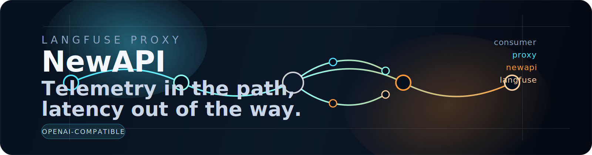

# NewAPI Langfuse Proxy



NewAPI Langfuse Proxy sits in front of a NewAPI upstream, forwards requests without changing the client-facing API, and sends Langfuse telemetry in the background. It is built for a single stable base URL that OpenAI-compatible SDKs and other tools can point at.

## What It Does

- Forwards requests to `UPSTREAM_BASE_URL` with the original path and query string
- Keeps streaming responses fast by teeing the upstream stream for background telemetry
- Captures request IDs, session IDs, user IDs, tags, and metadata for Langfuse
- Tracks TTFB, total latency, model, and token usage when the upstream response exposes it
- Shuts down cleanly and drains in-flight telemetry before exit

## Architecture

```text
Consumer -> Proxy -> NewAPI upstream
               \-> Langfuse telemetry
```

## Quick Start

```bash
bun install
cp .env.example .env
```

Set `UPSTREAM_BASE_URL` to your NewAPI root URL. Do not include `/v1` in the base URL unless your upstream is actually mounted there.

At minimum, configure Langfuse if you want telemetry:

```env
LANGFUSE_BASE_URL=https://cloud.langfuse.com
LANGFUSE_PUBLIC_KEY=pk-lf-...
LANGFUSE_SECRET_KEY=sk-lf-...
```

Run the service:

```bash
# Development
bun dev

# Production
bun start
```

## Environment Variables

| Variable                   | Description                                                 | Default                  |
| -------------------------- | ----------------------------------------------------------- | ------------------------ |
| `NODE_ENV`                 | Environment mode                                            | `development`            |
| `PORT`                     | Server port                                                 | `3000`                   |
| `LOG_LEVEL`                | Pino log level (`debug`, `info`, `warn`, `error`, `silent`) | `info`                   |
| `UPSTREAM_BASE_URL`        | NewAPI upstream base URL                                    | `https://api.openai.com` |
| `PROXY_TIMEOUT_MS`         | Upstream request timeout in ms                              | `300000`                 |
| `TELEMETRY_MAX_BODY_BYTES` | Max response body buffered for telemetry                    | `1048576`                |
| `LANGFUSE_BASE_URL`        | Langfuse instance URL                                       | `https://cloud.langfuse.com` |
| `LANGFUSE_PUBLIC_KEY`      | Langfuse public key. Leave empty to disable telemetry       | -                        |
| `LANGFUSE_SECRET_KEY`      | Langfuse secret key. Leave empty to disable telemetry       | -                        |

## API Surface

| Endpoint             | Description |
| -------------------- | ----------- |
| `ALL /v1/*`          | OpenAI-compatible proxy to the upstream |
| `ALL /deepseek/v1/*` | DeepSeek-compatible proxy to the same upstream |
| `ALL /*`             | Fallback passthrough for unmatched paths |
| `GET /api/health`    | Health check with upstream reachability |

Any additional upstream routes, including provider-specific ones, are passed through unchanged when your NewAPI instance exposes them.

The health endpoint returns the package version and upstream status:

```json
{
  "name": "langfuse-proxy",
  "version": "0.0.0",
  "status": "ok",
  "upstream": {
    "newapi": "ok"
  }
}
```

## Deployment

### Docker

```bash
docker build -t langfuse-proxy .
docker run -p 3000:3000 --env-file .env langfuse-proxy
```

The image is built from a standalone Bun binary in a multi-stage Dockerfile.

## Development

```bash
bun dev
bun test
bun lint
bun format
bun check
```

## License

[MIT](LICENSE)
